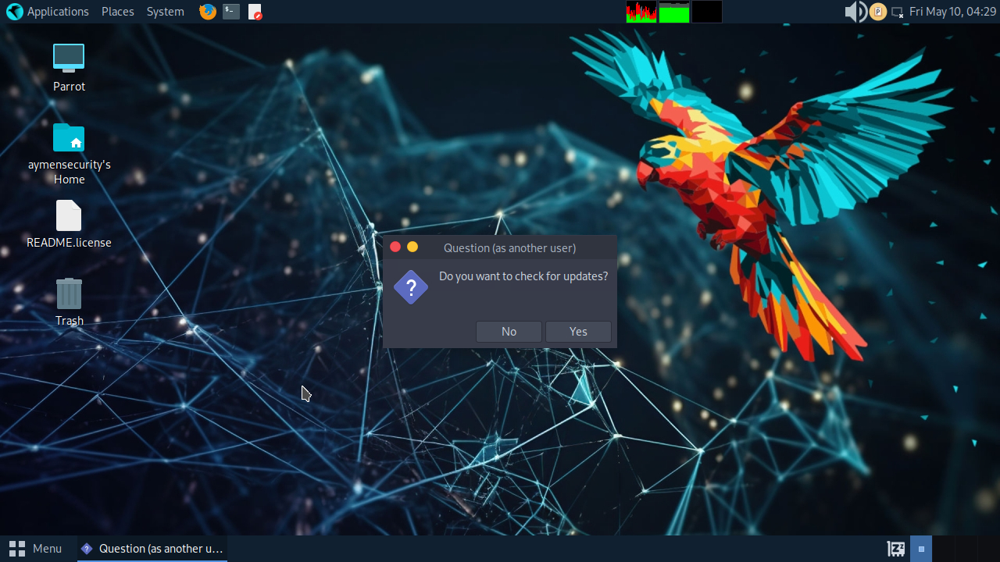
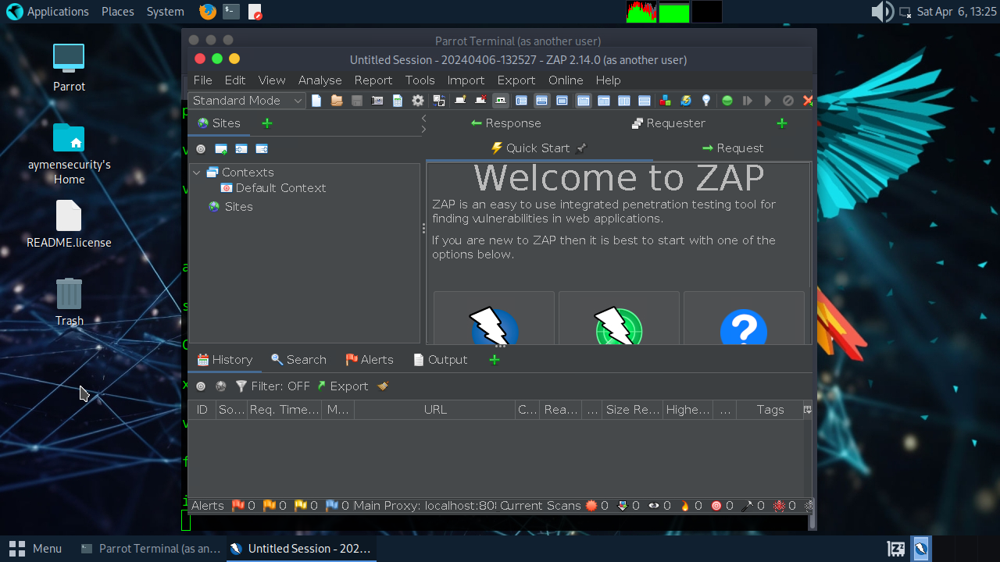

<center></center>
<h3>Parmux: Automated parrot os installer tool for termux</h3>

<h2>Features:</h2>

 🌐2 browsers Firefox and chromium
 
 🎨gimp and inkscape used  to graphic design
 
 🎵vlc player   
 
 🔊 sound work
 
<center></center

<center></center> 


 
# instalttion 
```bash
pkg update -y && pkg upgrade -y
pkg install git wget -y
git clone https://github.com/aymensecurity/parmux.git
cd parmux
mv * $HOME
cd $HOME
bash parmux.sh
./start-parrot.sh
bash gui.sh
# then choose your favorite desktoo *MATE*, *XFCE*, *LXDE*.
```
<h3>If you want install all hacking parrot os tool use this command.</h3>

```bash
sudo apt install parrot-tools-full -y
```

